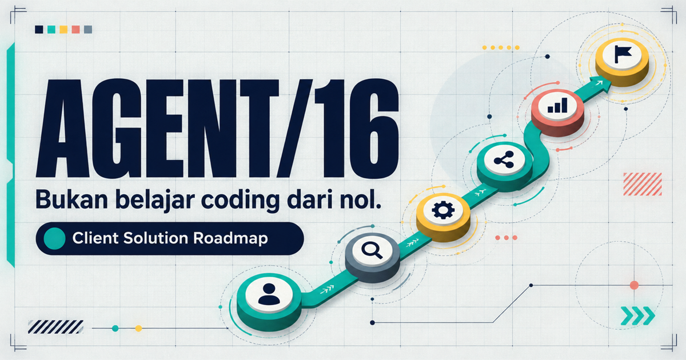

# AGENT/16 — Client Solution Roadmap

[](https://github.com/Jokskuyy/jalan-kebenaran/actions/workflows/ci.yml)

> **Bukan belajar coding dari nol. Belajar mengirim solusi agentic AI yang bisa dipercaya client.**

**[Open the live roadmap](https://jalan-kebenaran.vercel.app)**



AGENT/16 is an interactive, mission-based 16-week operating system for an informatics graduate targeting AI Engineer, AI Application Engineer, Agentic AI Developer, or AI Automation roles. It prioritizes the work clients actually need: discovery, architecture, integration, evaluation, reliability, safety, and measurable business outcomes. Python, FastAPI, SQL, Docker, and CI are treated as supporting delivery skills—not the destination.

Every week follows the same delivery practice:

`Learn → Inspect client evidence → Attempt solo → AI review → Revise → Pass gate → Ship`

The AI is deliberately constrained to act as a tutor, coach, and client simulator. It gives every client scene a short, contextual answer frame so a beginner can start reasoning without being handed the answer, then teaches the concept through feedback on that attempt. It asks no more than five discovery questions, scores a visible rubric, and returns a revision checklist instead of completing the final artifact.

## What this repository proves

- A client problem can be framed before a framework is selected.
- Agent actions can be bounded by typed contracts, state, permissions, and human approval.
- RAG quality can be evaluated with retrieval, citation, and abstention metrics.
- Business workflows can survive retries, duplicate events, and partial failures.
- Portfolio claims can be backed by evaluation reports, threat models, demos, and limitations.

## Product features

- Mission Control with start date, automatically calculated current week, progress, and next milestone.
- Clickable delivery loop: `Discover → Design → Orchestrate → Evaluate → Operate → Prove`.
- Sixteen story-first missions with 48 contextual answer frames that place the learner in a client scene, provide a neutral response shape, wait for a decision, reveal the concept through feedback, and only then move toward the weekly deliverable.
- Collapsible Mission Kits with official learning resources, synthetic client evidence, downloadable starter files, deliverable specifications, visible rubrics, and quality gates.
- A deterministic **Copy full mission** prompt that includes the case, evidence, constraints, files, output format, rubric, and coach-first protocol—ready for a new AI chat.
- A structured **Mission Debrief** receipt for every week: paste the AI review, validate it against that week's rubric, inspect or edit the preview, then save it locally.
- A deterministic **Final After-Action Report** that unlocks after 48 tasks, 16 gates, and 16 debriefs, with nine capability scores, a 16-week mission trace, safety floor, strengths, priority improvements, and Markdown export.
- Filter-aware skill map that separates core capabilities from supporting engineering.
- Two scoped portfolio labs: **RegulaRAG ID** and **InvoiceOps Agent**.
- Job-ready evidence checklist, role radar, and weekly application cadence.
- Browser-only persistence with graceful recovery from corrupted local data.
- Keyboard-accessible controls, visible focus states, responsive layout, and reduced-motion support.

## Roadmap structure

| Weeks | Mission | Primary evidence |
| --- | --- | --- |
| 1–2 | Client problem framing and agent-fit assessment | Problem brief, workflow map, decision scorecard |
| 3–4 | Tool contracts and the agent control plane | Contract tests, state machine, failure matrix |
| 5–8 | RegulaRAG ID and evaluation | RAG demo, golden set, evaluation report, threat model |
| 9–13 | InvoiceOps Agent and operations | Typed integrations, approval queue, failure report, scorecard |
| 14–16 | Case studies, communication, interviews, applications | Two polished cases and a measurable job-search loop |

Weeks 1–8 use **RegulaRAG ID** as one continuous anchor case. Weeks 9–13 use **InvoiceOps Agent**. Weeks 14–16 turn evidence from both projects into English case studies, interview defenses, and a measurable application sprint.

The typed source of truth lives in [`src/data/roadmap.ts`](src/data/roadmap.ts) and [`src/data/missions.ts`](src/data/missions.ts). The downloadable training dossiers live under [`public/cases`](public/cases/README.md).

## Weekly time budget

| Share | Activity | Output |
| ---: | --- | --- |
| 10% | Just-in-time learning | Only the concepts needed for this mission |
| 10% | Client evidence and planning | Assumptions, questions, and an attack plan |
| 55% | Build | A working artifact or system increment |
| 15% | Evaluate and red-team | Failure evidence and revision decisions |
| 10% | Ship | Documentation, demo, and career evidence |

Coaching and explanation are in Bahasa Indonesia. Schemas, ADRs, READMEs, evaluation reports, and primary case studies use working English.

## Local development

Requirements: Node.js 22.13+ and pnpm 11.

```bash
pnpm install --frozen-lockfile
pnpm dev
```

Open `http://localhost:5173`.

## Validate the project

```bash
pnpm typecheck
pnpm test
pnpm build
```

The GitHub Actions workflow runs the same checks on every push and pull request. Tests validate all 16 case assignments, 48 unique non-leaking answer frames, story-beat order, resource limits, prompt completeness and determinism, assessment markers and rubric identities, strict paste validation, corrupted-storage recovery, equal weekly weighting, the 80/20 readiness formula, nine capability mappings, safety-floor behavior, final-report unlock rules, starter-file existence, roadmap structure, and legacy progress parsing.

## Deployment

The site is a React/Vite SPA hosted on Vercel. The repository is connected through the official GitHub–Vercel integration:

- Every branch and pull request receives a Preview Deployment.
- Merges to `main` update Production.
- Vercel builds with `pnpm build` and serves `dist`.
- [`vercel.json`](vercel.json) rewrites all routes to `index.html`, so direct refreshes do not return 404.

No deployment secret is stored in GitHub.

## Privacy and data

Progress is stored only in the visitor's browser under `agent16-progress:v1`; Mission Debriefs are stored separately under `agent16-assessments:v1`. There is no account, backend, database, analytics payload, or client data. Re-importing a debrief and resetting all local records both ask for confirmation. The readiness conclusion is derived locally from the latest saved state and is never treated as a certification or guarantee of employability.

The portfolio project specifications and downloadable starter packs use public or synthetic data. They contain no real client, vendor, invoice, PO, employee, or confidential business data. Any benchmark or ROI claim produced while following this roadmap must be labeled as a simulation unless it comes from an authorized real-world engagement.

## License

[MIT](LICENSE)
